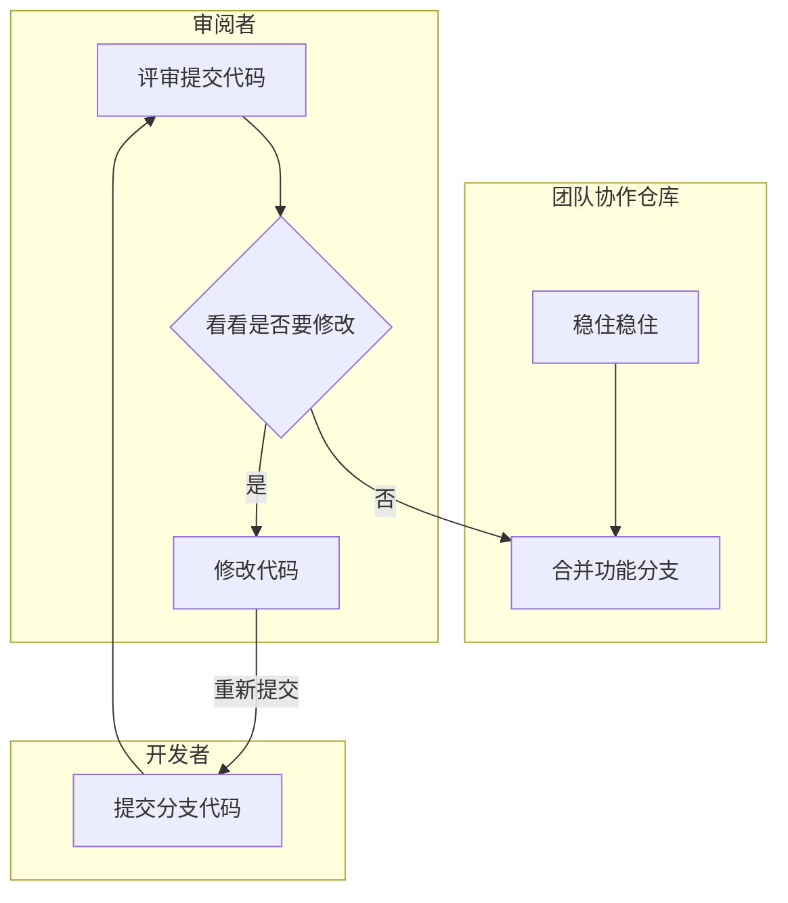

代码审阅（Code Review） 是项目中的必需项。

## 代码审阅流程

大致的审查流程大致如下流程图所示，即

1. 开发者完成开发后，将功能分支提交并提醒审阅者进行代码审查

2. 评审者审阅代码，假设没有存在问题则让开发者将功能分支合并至开发分支，否则组织评审会，指出相应的不合理之处并讨论出可行方案进行更改

3. 开发者根据修改方案进行代码修复，完成后再次提交，返回 `1`

## 代码审阅内容

业务上确保业务定义的功能正常运行 以及 业务后续的可迭代性

- 业务处理

  即功能实现是否能正常运行、满足预期的效果，同时确保业务的合理性 与 可迭代性。

- 业务规范

  使用正确的姿势正确处理业务，尽量禁止特殊处理 或者 歧义方式。

- 规范习惯

  必须编写并更新项目文档、接口文档。

  

代码上必须遵循项目规范，主要是从项目规范审阅，详细查看其它规范章节

- 命名规范

- 日志输出

- 代码注释

- 代码优化

- 数据库规范

- 事务处理

- 代码复用

- 效率与性能( 稳定性、健壮性 )

- 事务处理

- 项目架构目录定义规范

- 可读性、可维护性

- 代码安全性

- 单元测试
